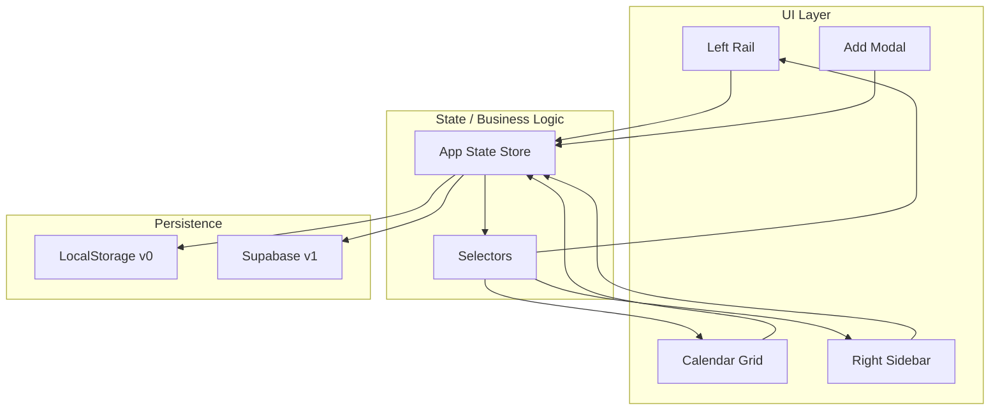
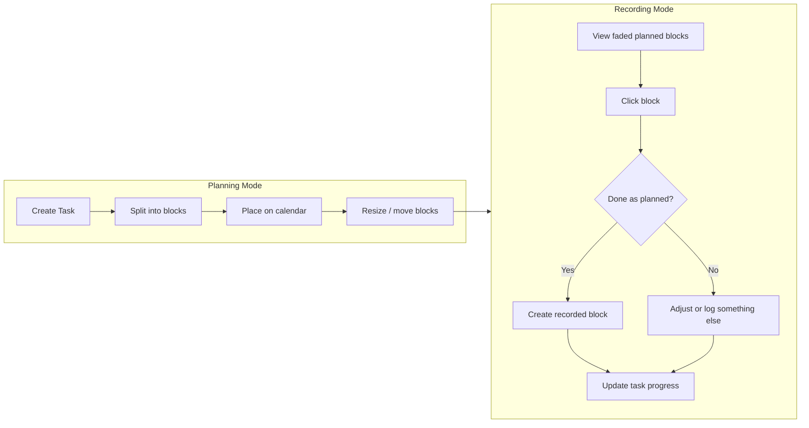
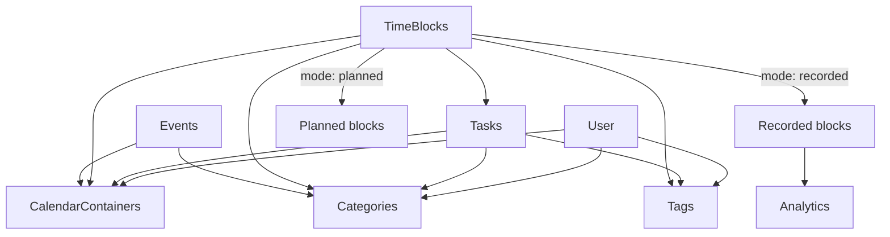
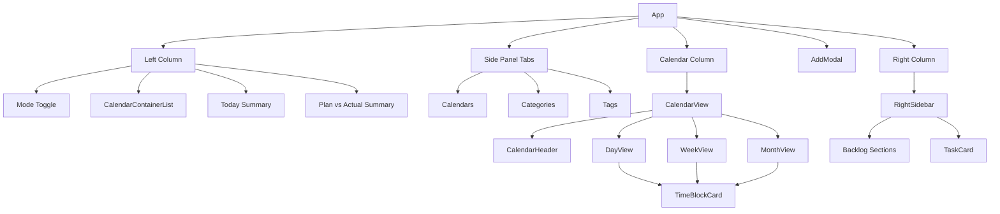
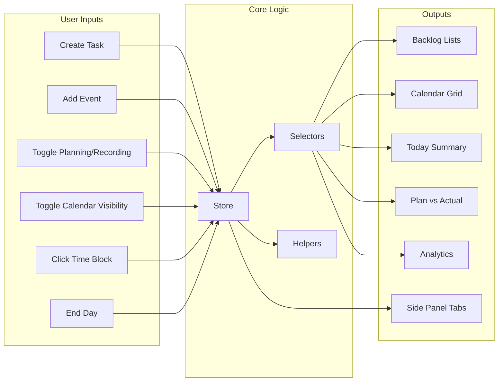

# Timebox — Engineering Lead Document

Reference for progression, checkpoints, and how the app works. Use this to add/manage functionalities and onboard engineers.

**→ [TASK_LIST.md](./TASK_LIST.md)** — Single task list of all unfinished work (design, functionality, tests, backend). Check off items there as you complete them.

---

## Docs for engineers (read and follow)

| Doc | Purpose |
|-----|--------|
| **[ONBOARDING.md](./ONBOARDING.md)** | Start here: read order, repo layout, run instructions, how to pick work. |
| **[SYSTEM_INTEGRATION.md](./SYSTEM_INTEGRATION.md)** | How the app fits together: state ↔ UI ↔ persistence, Supabase touchpoints, integration checklist. |
| **[UIUX_STANDARDS.md](./UIUX_STANDARDS.md)** | Calendar interaction and UI/UX principles (“is this the most intuitive way?”), Notion/GCal references. |
| **[PROJECT_STANDARDS.md](./PROJECT_STANDARDS.md)** | Code style, naming, testing, commits, PR checklist, definition of done. |

New engineers: read ONBOARDING first, then the rest as needed. Before changing state or API, read SYSTEM_INTEGRATION. Before changing layout or interaction, read UIUX_STANDARDS. Before every change, follow PROJECT_STANDARDS.

---

## 1. Checkpoints (Progression)

| Checkpoint | Phase | Scope | Done |
|------------|--------|--------|------|
| **CP0** | Phase 0 | Baseline: scrolling, container filtering, single seed data | ☑ |
| **CP1** | Phase 1 | Single state store + selectors (backlog, analytics) | ☑ |
| **CP2** | Phase 1 | Task creation + backlog sections (Unscheduled, Partially Completed, Fixed/Missed, Events) | ☑ |
| **CP3** | Phase 1 | Task → Planned TimeBlocks (split/schedule) | ☑ |
| **CP4** | Phase 1 | Recording: done-as-planned, done-different, did-something-else | ☑ |
| **CP5** | Phase 1 | End Day sweep (auto-assume unrecorded planned blocks) | ☑ |
| **CP6** | Phase 1 | Analytics: Planned + Recorded by container/category/tag, with Plan vs Actual comparison | ☑ |
| **CP6b** | Phase 1 | Side panel: editable Calendar/Tag/Category management (tabs, Notion-style; categories groupable) | ☑ |
| **CP7** | Phase 1 | Unit + E2E tests for core flows | ☐ |
| **CP8** | Phase 2 | Supabase: auth (Email OTP) + tables + RLS | ☐ |
| **CP9** | Phase 2 | Persistence layer swap (localStorage → Supabase) | ☐ |
| **CP10** | Phase 3 | Drag-and-drop from backlog to calendar + resize blocks (30-min snap) | ☑ |
| **CP11** | Phase 4 | Google Calendar integration (deferred) | ☐ |

**How to use:** When a checkpoint is complete, mark `Done` (☑). New features or bugs should map to a checkpoint or a new one.

---

## 2. How the Entire App Works (Flowcharts)

### 2.1 High-level architecture

### 2.2 User flows (Planning vs Recording)

### 2.3 Data flow (entities and dependencies)

### 2.4 Category, Calendar, Tag (mental model)

- **Category** — *Type of thing to do per day* (e.g. Deep Work, Meetings, Exercise). Each category has its own **color**. That color is the **block fill** on the calendar. Every task and block has exactly one category.
- **Calendar** — *Function or bucket* (e.g. Work, School, Personal). Each calendar has a color used as the **left border** on blocks to differentiate buckets. Within one calendar you have many categories. Every task and block has exactly one calendar.
- **Tag** — *Optional* label for things under a bucket that are done often or always (e.g. “dance” under Hobby). Not everything needs a tag; all tasks/blocks need a category and a calendar.

**On the block:** Background = category color. Left border = calendar color. Tags appear as labels (optional).

### 2.5 Component hierarchy and responsibilities

All calendar views (Day, Week, Month) render blocks via **TimeBlockCard**; DayView is the primary grid, WeekView and MonthView use the same card (compact where needed). Block interactions (click → done-as-planned / override) should work in all views where a block is clickable.

### 2.6 Managing different parts of the app

---

## 3. Function inventory and how to add/manage

### 3.1 Core functions (by area)

| Area | Function | Status | Notes |
|------|----------|--------|-------|
| **Tasks** | Create task | ✅ | AddModal → handleAddTask |
| **Tasks** | List by backlog section | 🔲 | Needs store selectors |
| **Tasks** | Edit / delete task | 🔲 | |
| **TimeBlocks** | Create planned from task | 🔲 | Split by defaultBlockMinutes |
| **TimeBlocks** | Create recorded (done-as-planned) | 🔲 | From Recording mode |
| **TimeBlocks** | Create recorded (override) | 🔲 | Did something else |
| **TimeBlocks** | Move / resize on grid | 🔲 | Phase 3 drag-drop |
| **TimeBlocks** | Delete block | 🔲 | |
| **End Day** | Sweep unrecorded → autoAssumed | 🔲 | |
| **Analytics** | By CalendarContainer (planned) | 🔲 | Today/summary for planned blocks |
| **Analytics** | By CalendarContainer (recorded) | ✅ | Today summary uses categories |
| **Analytics** | By Category (planned + recorded) | 🔲 | Both; enable Plan vs Actual comparison |
| **Analytics** | By Tag (planned + recorded) | 🔲 | Both; enable Plan vs Actual comparison |
| **Analytics** | Plan vs Actual comparison | 🔲 | Side-by-side or delta by container/category/tag |
| **Events** | Create / list / attended-missed | 🔲 | Simple v0 |
| **Side panel** | Editable Calendars (add/edit/delete, visibility) | 🔲 | Notion-style tabs *(CP6b)* |
| **Side panel** | Editable Categories (add/edit/delete, optional parent group e.g. Personal care) | 🔲 | Categories can be grouped *(CP6b)* |
| **Side panel** | Editable Tags (add/edit/delete, optional link to category) | 🔲 | *(CP6b)* |

✅ = exists, 🔲 = to build

**Note (TimeBlockCard):** DayView, WeekView, and MonthView all use TimeBlockCard to render blocks. Ensure click actions (Recording: done-as-planned / override) work in Week and Month views where blocks are shown, not only in DayView.

**Analytics (planned + recorded, Plan vs Actual):** Show both planned and recorded time by CalendarContainer, Category, and Tag so users can compare (e.g. "Planned: 5h Work, Recorded: 3h Work"). Today/summary can show two rows or columns (planned vs recorded) or a delta.

**Side panel (Notion-style):** A tabbed side panel (or section in the left rail) for **Calendars**, **Categories**, and **Tags**. Each tab is editable: add, rename, delete, set color. Categories support an optional **parent group** (e.g. "Personal care" with children "Exercise", "Eating") so they can be mapped together. Reference Notion’s sidebar where items are grouped. The panel should be the single place to manage these settings.

### 3.2 Adding a new function

1. **Identify checkpoint** (e.g. CP3 for task→blocks).
2. **Decide layer:** UI only → component; state change → store action; persistence → adapter.
3. **Update this doc:** add row to Function inventory, update flowchart if new user flow.
4. **Test:** unit for logic, E2E for critical path.

### 3.3 Managing existing functionality

- **Bug:** map to checkpoint where feature was added; fix in that layer (UI vs store vs persistence).
- **Change in spec:** update product spec first, then this doc (checkpoints + flowcharts), then code.
- **Refactor:** keep store as single source of truth; avoid duplicating logic in components.

---

## 4. File map (where things live)

| Purpose | Location |
|---------|----------|
| Types | `src/types.ts` |
| Task/block helpers | `src/utils/taskHelpers.ts` |
| Data resolution (IDs → full objects) | `src/utils/dataResolver.ts` |
| Migration (old → new format) | `src/utils/migrateData.ts` |
| Seed data | `src/data/seed.ts` |
| Store | TBD: `src/store/` (Phase 1) |
| Persistence adapter | TBD: `src/data/` (Phase 1–2) |

---

## 5. Reference links

- **Task list (unfinished work):** [docs/TASK_LIST.md](./TASK_LIST.md) — actionable checklist; link and manage tasks here.
- **Engineer docs:** [ONBOARDING](./ONBOARDING.md), [SYSTEM_INTEGRATION](./SYSTEM_INTEGRATION.md), [UIUX_STANDARDS](./UIUX_STANDARDS.md), [PROJECT_STANDARDS](./PROJECT_STANDARDS.md).
- **Product spec:** See project root or `docs/` for consolidated v0 spec (planning vs recording, entities, backlog sections).
- **Roadmap plan:** `.cursor/plans/timebox-supabase-roadmap_*.plan.md`.

---

*Last updated: with Phase 0–4 checkpoints, full app flowcharts, and task list link.*
